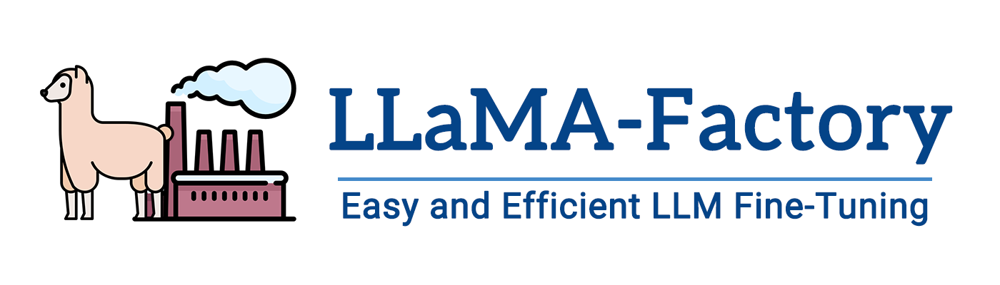
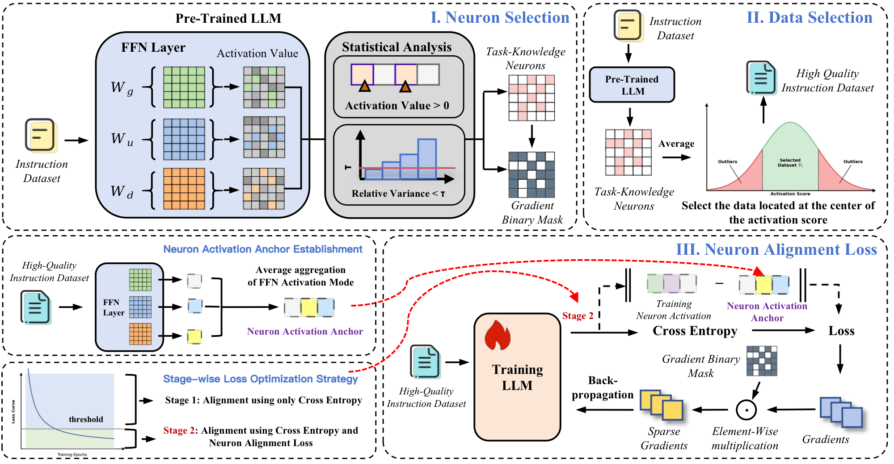

<div align="center">



# Neuron-Guided Fine-Tuning (NGFT)

### Unlocking Efficient Alignment Mechanisms for Large Language Models

</div>

---

## Overview

**NGFT** (Neuron-Guided Fine-Tuning) is a holistic fine-tuning framework that leverages **neuron activation patterns** as a *universal proxy* to unify the fine-tuning lifecycle. Existing SFT paradigms suffer from parameter redundancy, inconsistent data quality, and catastrophic forgetting. These issues are typically addressed in isolation in previous studies. NGFT bridges this gap by using neuron activation signals to jointly govern **data selection**, **parameter updates**, and **knowledge preservation**.

<div align="center">

| Key Result | Value |
|:---:|:---:|
| Domain Performance Gain (avg.) | **+4.66 pts** over FPFT |
| Forgetting Mitigation (avg.) | **+9.89 pts** over FPFT |
| Computational Cost | **~20.63%** of FPFT |

</div>

---

## Framework

NGFT consists of three synergistic mechanisms that cover the full fine-tuning lifecycle:

<div align="center">



</div>

### (I) Task-Knowledge Neuron Selection

Identifies a sparse set of **Task-Knowledge Neurons** that are consistently and stably activated across the training data. Unlike fixed-ratio methods, NGFT adaptively calibrates optimal sparsity using the **Coefficient of Variation (CV)**:

- **Activation State Constraint**: Neurons with positive activation values respond effectively to input
- **Distribution Stability Constraint**: Low-CV neurons are stably activated and critical to performance
- **Gradient Masking**: Only key neuron parameters are updated; non-essential neurons are frozen

### (II) Activation-Based Data Selection

Selects high-quality instruction data based on **neuron activation intensity**. Samples near the median of the activation distribution strike the optimal balance between:

- **Sufficiency** — preserving task-relevant information
- **Minimality** — eliminating redundant noise

This median-centered strategy absorbs core samples from all sub-clusters, ensuring robustness to intra-class multimodal distributions.

### (III) Neuron Alignment Loss

A novel loss function that aligns model activation patterns with **pre-computed activation anchors** derived from ground-truth responses:

- **Coarse-to-Fine Optimization**: Activated only after CE loss stabilizes (below threshold &gamma;)
- **Deep Knowledge Internalization**: Guides the model to learn neuron-level representations
- **Anti-Forgetting**: Preserves general knowledge by anchoring to pre-trained activation states

---

## Quick Start

### 1. Environment Setup

```bash
conda create -n ngft python=3.10
conda activate ngft
cd NGFT
pip install -e ".[torch,metrics]"
```

### 3. Data Selection

```bash
python neuron_data_selection.py \
    --model_path mistralai/Mistral-7B-Instruct-v0.3 \
    --data_path data/gsm8k_dataset.json \
    --output_path data/selected_data.json \
    --sampling_ratio 0.10
```

### 4. Run NGFT Pipeline


```bash
# GSM8K on Mistral-7B. This pipeline includes training and evaluation.
# Other datasets and scripts are being organized and will be available soon.
python pipeline_mistral/pipeline_GSM.py

```
---

## Core Code

> If you only want to reference the core NGFT code, you can check these two files. They contain detailed explanations to help you integrate them into your own project.

| File | Description |
|:---|:---|
| [neuron_data_selection.py](neuron_data_selection.py) | Neuron selection and data selection |
| [trainer.py](trainer.py) | NGFT training, including updating targeted neuron parameters and neuron alignment loss |


## Acknowledgments
This project is built upon [LLaMA-Factory](https://github.com/hiyouga/LLaMA-Factory). We thank the open-source community for their valuable contributions.
